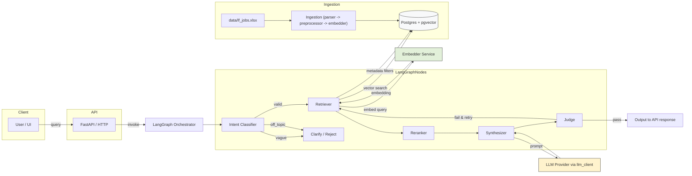

# RAG Pipeline for Job Data Retrieval

A comprehensive technical specification and operational guide for this project. Retrieval-Augmented Generation (RAG) pipeline built with LangGraph. This document serves as a proper documentation to know what the system is about and how it works.

---

## Contents
- Project Overview
- High-Level Architecture
- Engineering Decisions & Reasoning
- RAG Pipeline: Detailed Breakdown
- LangGraph Node Descriptions
- API Documentation
- Setup & Installation Instructions
- Example Usage
- Observability & Monitoring
- Assumptions Made During Development
- Drawbacks & Limitations
- Future Enhancements

---

## 1. Project Overview

### What the system does
The system is a Retrieval-Augmented Generation (RAG) system designed to serve conversational, context-grounded job search answers. Users submit natural-language queries (e.g., "Senior ML engineer roles in NYC") and receive concise, source-backed job recommendations synthesized by an LLM using a semantically retrieved subset of job descriptions.

System Includes:
- Fast, filterable retrieval of job postings from a curated dataset (LF Jobs).
- Context-aware LLM responses constrained to retrieved content.
- A judgment layer that assesses output quality and either approves or triggers a re-retrieval loop.
- Observability via LangSmith traces for per-node latency and token insights.

### Key capabilities
- Intent-aware routing (vague/off-topic/valid).
- Hybrid retrieval (semantic vector search + keyword signals).
- Source-backed answer generation (no invented facts).
- Automated quality control and retry logic.
- Pydantic-typed API (FastAPI) with simple query and filters.
- Production-ready traces for debugging and auditing.
 
### Dataset summary
The system is built on the "LF Jobs" dataset:
- Source: LF Jobs Dataset
- Rows: 1,000 job listings
- Companies: 145 unique
- Categories: 7 unique job categories
- Schema (9 columns × 1,000 rows):
  - ID: Unique LF#### identifier
  - Job Category
  - Job Title
  - Company Name
  - Publication Date (ISO 8601)
  - Job Location
  - Job Level (Mid, Senior, Internship, etc.)
  - Tags (array)
  - Job Description (HTML-formatted)

Dataset schema (as table)

| Column | Type | Description |
|---|---|---|
| id | TEXT | Unique LF#### identifier (primary key) |
| job_category | TEXT | Category for filtering (e.g., fintech, infra) |
| job_title | TEXT | Human-readable job title |
| company_name | TEXT | Employer / company field |
| publication_date | TIMESTAMP | ISO 8601 publication date |
| job_location | TEXT | City / region text |
| job_level | TEXT | Seniority (Intern / Mid / Senior) |
| tags | TEXT[] | Array of short tag strings |
| job_description | TEXT | Raw HTML description (ingested & chunked) |

---

## Repo structure

```
.
├── .env.example
├── nginx.conf
├── docker-compose.yml
├── .gitignore
├── README.md
├── docs
│   ├── ARCHITECTURE.md
├── pyproject.toml
├── Makefile
├── Dockerfile
├── uv.lock
├── requirements.txt
├── frontend
│   ├── js
│   │   └── app.js
│   ├── css
│   │   └── style.css
│   └── index.html
├── app
│   ├── ingestion
│   │   ├── parser.py
│   │   └── preprocessor.py
│   ├── schemas
│   │   ├── response.py
│   │   └── request.py
│   ├── core
│   │   ├── logging.py
│   │   └── config.py
│   ├── infrastructure
│   │   ├── indexing
│   │   │   └── llama_cloud.py
│   │   ├── llm
│   │   │   └── gemini_client.py
│   │   ├── db
│   │   │   ├── repository.py
│   │   │   ├── connection.py
│   │   │   └── vectorstore.py
│   │   └── embeddings
│   │       └── bge_m3.py
│   ├── api
│   │   ├── __init__.py
│   │   └── v1
│   │       ├── router.py
│   │       └── endpoints
│   │           ├── load.py
│   │           └── query.py
│   ├── retrieval
│   │   ├── rerank.py
│   │   └── hybrid_search.py
│   ├── orchestration
│   │   └── langgraph
│   │       ├── prompts
│   │       │   ├── reasoning_agent.py
│   │       │   ├── judge.py
│   │       │   ├── synthesizer.py
│   │       │   └── intent_classifier.py
│   │       ├── schemas
│   │       │   ├── reasoning.py
│   │       │   ├── judge.py
│   │       │   ├── synthesizer.py
│   │       │   └── terminal.py
│   │       ├── state
│   │       │   └── graph_state.py
│   │       ├── utils
│   │       │   ├── json.py
│   │       │   ├── messages.py
│   │       │   ├── context.py
│   │       │   └── prompt_builder.py
│   │       ├── edges.py
│   │       ├── graph.py
│   │       └── nodes
│   │           ├── reasoning_agent.py
│   │           ├── judge.py
│   │           ├── synthesizer.py
│   │           ├── intent_classifier.py
│   │           ├── retriever.py
│   │           └── terminal_nodes.py
│   └── main.py

```

### Architecture diagram



---

## 2. High-Level Architecture

### System pipeline (numbered flow)
1. Client → POST /api/query (user query + optional filters).
2. LangGraph START → `intent_classifier`.
3. `route_intent` decides: `retriever` | `clarify` | `reject`.
4. `reasoning_agent` (optional): compute retrieval plan, expand filters.
5. `retriever`: vector search → top candidates (keyword FTS currently unused).
6. `synthesizer`: assemble context block, call LLM to generate answer.
7. `judge`: evaluate answer quality / hallucination.
8. `route_judge`: either `output` or re-enter `retriever` (retry loop).
9. `output`: final response assembled and returned to client.

(Components: FastAPI backend, LangGraph orchestrator, embedding service, vectorstore, LLM client via OpenRouter, LangSmith tracing.)

> ⚠️ Note: The pipeline is stateful and supports retry loops; this is central to maintaining high result fidelity.

### Why LangGraph?
We chose LangGraph because:
- Stateful graph semantics: nodes share a single `GraphState` payload which simplifies complex branching and retry logic.
- Conditional routing: edges can branch based on node outputs (intent, judge verdict), enabling clarification and retries.
- Observability: LangGraph integrates well with per-node tracing and structured prompts.
- Modularity: Each node is a unit of logic and testing; nodes follow a strict contract (return only keys they modify).

### Why RAG for job search?
- Fact grounding: Job descriptions contain structured facts (title, location, level). RAG ensures LLM outputs are grounded in actual job text.
- Precision: Matching user constraints (location, level) with structured filters plus semantic similarity reduces irrelevant results.
- Explainability: Sources can be surfaced so users see which job chunks informed the output.
- Cost: LLM context size is limited; RAG keeps prompts small and relevant.

### Detailed Preprocessing (Assignment Req #1)

- Raw HTML example (input):

```html
<div class="job-listing">
  <h1>Senior Machine Learning Engineer</h1>
  <p><strong>Company:</strong> Acme AI</p>
  <p><em>Responsibilities:</em></p>
  <ul>
    <li>Design and deploy ML systems.</li>
    <li>Collaborate with data scientists.</li>
  </ul>
  <!-- malformed tag below -->
  <p>Requirements: Python, TensorFlow
</div>
```

- Cleaned text (after processing):

```
Senior Machine Learning Engineer
Company: Acme AI
Responsibilities: Design and deploy ML systems. Collaborate with data scientists.
Requirements: Python, TensorFlow
```

- Cleaning steps applied (explicit):
  - HTML stripping: `BeautifulSoup(html, "html.parser").get_text(separator=" ")` to preserve sentence boundaries.
  - Whitespace normalization: collapse multiple spaces/newlines to a single space and trim leading/trailing whitespace.
  - Removal of script/style tags: explicitly drop content inside `<script>` and `<style>` before extracting text.
  - HTML entity decoding: convert `&amp;`, `&nbsp;`, etc. to their unicode equivalents.
  - Malformed HTML handling: `BeautifulSoup` tolerantly parses and recovers from unclosed tags (see example above where missing `</p>` is handled).
  - Character filtering: remove non-printable control characters and normalize unicode to NFC.

- Edge-case handling:
  - Empty descriptions: rows with empty or whitespace-only cleaned text are dropped during ingestion and logged as `dropped_rows` with reason "empty_description".
  - Very short descriptions (under ~50 characters): retained but flagged in metadata `short_description=true` so retriever/synthesizer can weight them lower or surface fewer matches.
  - Malformed HTML: `BeautifulSoup` recovers most cases; if parsing fails entirely we log the row and keep the original raw string as fallback (but mark it as `parsing_error`).

- Chunking example (token-based approx): target chunk size ≈512 tokens (demo-sized example below uses smaller segments for readability):

Cleaned text → chunks (illustrative):

```
Chunk 0: Senior Machine Learning Engineer Company: Acme AI Responsibilities: Design and deploy ML systems.
Chunk 1: Collaborate with data scientists. Requirements: Python, TensorFlow
```

The real ingestion uses a RecursiveCharacterTextSplitter-like splitter with `chunk_size=512` and `chunk_overlap=64` to create coherent chunks while preserving overlap for boundary continuity.

---

---

## 3. Engineering Decisions & Reasoning

Documented major design choices and rationales.

- LangGraph over a linear chain
  - What: Use a stateful directed graph with conditional edges and node retries.
  - Why: Complex conversational flows (clarify → retrieve → judge → retry) are easier to model as a graph; clearer observability and unit testing per node.

- Intent classification before retrieval
  - What: A fast classifier determines if a query is valid, vague, or off-topic.
  - Why: Prevents wasted retrieval/LLM cost for off-topic queries; identifies when a clarification question will greatly improve retrieval precision.

- Clarification node when ambiguous
  - What: For "vague" queries, system asks a targeted clarifying question.
  - Why: Better user UX and higher-quality retrieval with minimal extra cost.

- Chunking strategy
  - What: Strip HTML then chunk job descriptions using a RecursiveCharacterTextSplitter-like approach (target ~512 tokens, overlap 64).
  - Why: Job descriptions vary in length and contain structured sections; chunking preserves local context while keeping vector dimension fixed. (Max token found for JD: 1000 tokens)

- Embedding and vector store choices
  - What: Embeddings computed once at ingestion and stored as VECTOR(1024). Vector DB uses PostgreSQL + pgvector with HNSW index.
  - Why: Co-located metadata + vectors simplify filtering via SQL; PG + pgvector is lightweight and reproducible for up to ~100k chunks without external service.

- OpenRouter (ChatOpenAI) for LLM
  - What: LLM calls routed via `app/infrastructure/llm/gemini_client.py` through OpenRouter (OpenAI API compliant).
  - Why: Model-agnostic, straightforward to swap providers, cost-effective for demos; replacing provider requires only environment changes.

- LangSmith for observability
  - What: Tracing per LangGraph run with node-level latencies and token counts.
  - Why: Helps tune prompts, debug failures, and measure per-node performance.

- Judge node for quality control
  - What: LLM-based judge evaluates relevance, quality, hallucination, and issues a PASS/FAIL.
  - Why: Automated QA gate reduces hallucinations, improves user trust, and enables limited automatic retries when results aren't satisfactory.
 
- Confidence scoring
  - What: Judge returns numeric relevance/quality and composite score, displayed as PASS with percentage (e.g., 93%).
  - Why: Improves transparency and allows downstream UI filtering of lower-confidence results.

---

## 4. RAG Pipeline: Detailed Breakdown

### Preprocessing
- HTML Stripping:
  - Use BeautifulSoup(html, "html.parser").get_text(separator=" ") to sanitize descriptions.
  - Preserve meaningful separators (bullet lists → sentences).
- Normalization:
  - Collapse whitespace, remove repeated newlines, strip trailing whitespace.
- Chunking:
  - Recursive character splitting with chunk_size=512 tokens (approx 3–4× characters), overlap=64 tokens.
  - Keep chunk metadata: `job_id`, `chunk_index`, `source_field` (e.g., responsibilities, requirements), `company_name`, `job_title`, `job_level`, `job_location`.
- Filtering:
  - Drop empty chunks.
  - Keep provenance to allow the synthesizer to cite the job record.

### Embedding Generation
- Model used for demo/submission:
  - `BAAI/bge-m3` via `sentence-transformers` (implementation: `app/infrastructure/embeddings/bge_m3.py`). This open model was used for the submission/demo to avoid vendor API dependencies while providing strong semantic embeddings. (Took a lot of time to embedd 1k jobs, use openAI api for better embeddings)
- Embedding dimension:
  - `bge-m3` emits 1024-dimensional vectors; we persist embeddings as `VECTOR(1024)` in the DB. We chose 1024 because `bge-m3` natively uses that size and it provides improved semantic capacity vs 768-d models at the cost of slightly larger storage and compute.
- Batch processing:
  - Default batch size = 32. Rationale: 32 balances CPU/GPU memory usage and throughput across typical developer machines; it avoids OOM on smaller GPUs and performs well on CPUs. For GPU-based production runs you can increase to 64/128 to improve throughput.
- Storage:
  - Each chunk stored as a `VECTOR(1024)` with `created_at` timestamp.

### Vector Store Ingestion
- DB:
  - `jobs` table contains structured metadata; `job_chunks` stores `chunk_text` and `embedding` (`VECTOR(1024)`) produced at ingestion.
- Indexes:
  - HNSW index on `job_chunks.embedding`.
  - `job_chunks.job_id` index and `jobs` metadata indexes for fast filtering.
- Upsert:
  - Ingest job rows to `jobs` and chunks to `job_chunks` with ON CONFLICT upsert semantics.

### Retrieval
- Query flow:
  1. Embed the user query.
  2. Vector search (top K) via cosine similarity on `embedding`.
  3. Reranking is performed via the Jina reranker (`app/retrieval/rerank.py`); a legacy RRF implementation has been removed from the codebase.
  4. Apply metadata filters in SQL join to `jobs` (location, level, category).
 - Reranking:
  - Reranking is handled by the Jina reranker (`app/retrieval/rerank.py`) when configured. Additionally, a cross-encoder reranker (`cross-encoder/ms-marco-MiniLM-L-6-v2`) is available for CPU-based re-scoring of top candidates.
- Output:
  - Final top-N chunks (default 5) with chunk_text, job metadata, and score.

---

### Optional Enhancements Implemented

Implemented both optional enhancements from the assignment spec (these improve recall and precision):

 - Reranking is provided via the Jina reranker (`app/retrieval/rerank.py`) and optionally the cross-encoder reranker (`cross-encoder/ms-marco-MiniLM-L-6-v2`).


### Prompt Construction
- The synthesizer constructs a context block by concatenating the top retrieved chunk_texts and structured job metadata (job title, company, location, level).
- Prompt components:
  - System instruction: “You are a job search assistant. Answer using ONLY the job listings below.”
  - Context block: retrieved chunks with provenance.
  - User query: raw user query.
- Response constraints:
  - List each recommended job as `[Job Title] at [Company] · [Location] · [Level]` + 1–2 sentence justification.
  - No invented data; cite nothing outside retrieved context.

### LLM Generation
- Model:
  - Synthesizer uses `get_llm("synthesizer")` from `app/infrastructure/llm/gemini_client.py`.
- Cost control:
  - Use concise prompts and context-trimming to stay within token limits.
- Output:
  - Answer string and `sources` array (job_id, job_title, matched_chunk excerpt, relevance_score).

### Quality Judge
- Inputs:
  - Query, retrieved chunks, and generated answer.
- Responsibilities:
  - Score relevance (0–1), quality (0–1), hallucination boolean.
  - Compute judge_score composite and produce `pass` or `fail`.
  - Provide a short reasoning explanation.
- Routing:
  - If `pass` → `output`.
  - If `fail` and `retry_count < max_retries` → increase `retry_count` and route back to `retriever` with modified plan (e.g., widen or narrow filters, ask reasoning_agent to adjust prompt).

---

## 5. LangGraph Node Descriptions

All nodes follow the contract: accept a `GraphState` and return a dict with only updated keys.

- intent_classifier
  - Input: `state["query"]`
  - Output: `{"intent": "valid"|"vague"|"off_topic", "clarification_question": str}`
  - Behavior: Use `get_llm("classifier")` to produce JSON response. Rules ensure no free text beyond JSON.

- route_intent
  - Input: `state["intent"]`
  - Output: routing decision string: `'retriever'`, `'clarify'`, or `'reject'`
  - Behavior: Maps `valid`→`retriever`, `vague`→`clarify`, `off_topic`→`reject`.

- reasoning_agent
  - Input: `state["query"]`, `state["filters"]`
  - Output: optional adjustments like expanded filters, synonyms, or retrieval hints.
  - Behavior: Uses a light-weight LLM reasoning step to refine retrieval plan—useful for multi-hop queries (e.g., "roles at fintech" → expand fintech synonyms).

- retriever
  - Input: `state["query"]`, `state["filters"]`
  - Output: `{"retrieved_chunks": list[dict]}`
  - Behavior: Purely retrieval (embeddings + keyword). No LLM calls. Returns chunk list with metadata and scores.

- synthesizer
  - Input: `state["query"]`, `state["retrieved_chunks"]`
  - Output: `{"answer": str, "sources": list[dict]}`
  - Behavior: Build context block + prompt. Use LLM to generate the constrained answer.

- judge
  - Input: `state["query"]`, `state["retrieved_chunks"]`, `state["answer"]`
  - Output: `{"judge_score", "judge_verdict","judge_reasoning","relevance_score","quality_score","hallucination_flag"}`
  - Behavior: Use `get_llm("judge")` to output JSON. Enforce numeric ranges and boolean flag.

- route_judge
  - Input: judge outputs
  - Output: `'output'` or `'retriever'` for retry loop.
  - Behavior: Retry only if `judge_verdict == "fail"` and `retry_count < max_retries`.

- output
  - Input: final answer + judge metadata
  - Output: `{"final_response": dict}`
  - Behavior: Format API response with `answer`, `sources`, `judge`, `intent`, `latency_ms`.

---

## 6. API Documentation

### Endpoint
POST /api/query

Base path: `/api/v1/query` or `/api/query` depending on `app/main.py` routing (use the router in `app/api/v1/router.py`).

### Request schema (JSON)
- query: string (required)
- top_k: integer (optional, default 5)
- filters: object (optional)
  - job_level: string
  - job_category: string
  - job_location: string

Example JSON:
```json
{
  "query": "Senior ML engineer jobs in NYC",
  "top_k": 5,
  "filters": {
    "job_location": "New York",
    "job_level": "Senior Level"
  }
}
```

Pydantic model: `app/schemas.request.QueryRequest` (see `app/schemas/request.py`).

### Response schema (JSON)
Successful response contains:
- query: original query
- answer: generated answer string (or clarification question if intent == "vague")
- sources: array of objects { job_id, job_title, company_name, job_level, job_location, relevance_score, matched_chunk }
- judge: { score, verdict, reasoning, relevance, quality, hallucination }
- intent: "valid"|"vague"|"off_topic"
- latency_ms: integer
- status: "PASS"|"FAIL" (derived from `judge_verdict`)

Example response:
```json
{
  "query": "Senior ML engineer jobs in NYC",
  "answer": "I found two senior-level machine learning roles in New York: ...",
  "sources": [
    {
      "job_id": "LF0123",
      "job_title": "Senior Machine Learning Engineer",
      "company_name": "Acme AI",
      "job_level": "Senior Level",
      "job_location": "New York, NY",
      "relevance_score": 0.92,
      "matched_chunk": "Experience with production ML systems, Python, TensorFlow..."
    }
  ],
  "judge": {
    "score": 0.93,
    "verdict": "pass",
    "reasoning": "Results are relevant and grounded in retrieved chunks",
    "relevance": 0.95,
    "quality": 0.91,
    "hallucination": false
  },
  "intent": "valid",
  "latency_ms": 52340,
  "status": "PASS"
}
```

### Error responses
- 422 Unprocessable Entity: invalid request JSON, missing `query`.
- 200 with intent == "vague": returns `{ "intent": "vague", "clarification_question": "..." }`.
- 200 with intent == "off_topic": returns `{ "intent": "off_topic", "message": "I can only help with job search queries." }`.
- 500 Internal Server Error: DB or LLM failure — response includes error id for tracing.

---

## 7. Setup & Installation Instructions

Prerequisites:
- Python 3.11+
- Postgres with pgvector (docker-compose provided)
- Git

Steps:

1. Clone the repo
```bash
git clone <repo-url> genai_leapfrog
cd genai_leapfrog
```

2. Create and activate virtual environment
```bash
# Recommended
uv init
uv venv .venv

# if python preferred:
python -m venv .venv

source .venv/bin/activate
```

3. Install dependencies
```bash
uv add -r requirements.txt

pip install -r requirements.txt
```

4. Start Postgres + pgvector (docker-compose provided)
```bash
docker compose up -d
```

5. Run DB migrations
```bash
psql $DATABASE_URL -f app/infrastructure/db/migrations/001_init.sql
```

6. Copy `.env` template and fill
```bash
cp .env.example .env
# edit .env to set DATABASE_URL, OPENROUTER_API_KEY or other provider keys, EMBEDDING_PROVIDER, etc.
```

7. Ingest data into vector store
 - The project includes ingestion scripts under `app/ingestion/` and `app/api/v1/endpoints/load.py`.
Basic ingestion (example):
```bash
python app/ingestion/parser.py data/lf_jobs.xlsx --output parsed.json
python app/ingestion/preprocessor.py parsed.json --chunks chunks.json
python -m app.api.v1.endpoints.load --file data/lf_jobs.xlsx --overwrite true
```
(Or use the API endpoint POST /api/v1/load to upload `data/lf_jobs.xlsx`.)

8. Start the FastAPI server
```bash
uvicorn app.main:app --reload --port 8000
```

9. Test the endpoint
```bash
curl -X POST http://localhost:8000/api/v1/query \
  -H "Content-Type: application/json" \
  -d '{"query":"Senior ML engineer roles in New York","top_k":5}'
```

---

## 8. Example Usage

Below are five unified example queries with request + realistic JSON responses.

1) Simple job search: `Backend roles at fintech companies`

Request:
```json
{ "query": "Backend roles at fintech companies", "top_k": 5 }
```

Response:
```json
{
  "query": "Backend roles at fintech companies",
  "answer": "Backend Engineer at FinPay · San Francisco · Mid — Works on microservices and payments APIs.\nBackend Software Engineer at CoinFlow · Remote · Senior — Experience building high-throughput payment pipelines.",
  "sources": [
    {"job_id":"LF045","job_title":"Backend Engineer","company_name":"FinPay","job_level":"Mid","job_location":"San Francisco","relevance_score":0.91,"matched_chunk":"Microservices, Go, Kubernetes, payments"},
    {"job_id":"LF210","job_title":"Backend Software Engineer","company_name":"CoinFlow","job_level":"Senior","job_location":"Remote","relevance_score":0.88,"matched_chunk":"Payment systems, Kafka, high-throughput services"}
  ],
  "judge": {"score":0.89,"verdict":"pass","reasoning":"Results match fintech backend skill keywords and locations","hallucination":false},
  "intent":"valid",
  "latency_ms": 1420
}
```

2) Filtered by location: `Senior data scientist roles` (San Francisco)

Request:
```json
{ "query": "Senior data scientist roles", "filters": { "job_location": "San Francisco", "job_level": "Senior Level" } }
```

Response:
```json
{
  "query": "Senior data scientist roles",
  "filters": {"job_location":"San Francisco","job_level":"Senior Level"},
  "answer": "Senior Data Scientist at DataWorks · San Francisco · Senior — Leads ML model development for product analytics.\nSenior Applied Scientist at ModelFlow · San Francisco · Senior — Focus on productionization and A/B testing of ML models.",
  "sources": [
    {"job_id":"LF134","job_title":"Senior Data Scientist","company_name":"DataWorks","job_level":"Senior","job_location":"San Francisco","relevance_score":0.93,"matched_chunk":"Lead ML models, product analytics, SQL"},
    {"job_id":"LF189","job_title":"Senior Applied Scientist","company_name":"ModelFlow","job_level":"Senior","job_location":"San Francisco","relevance_score":0.9,"matched_chunk":"Production ML, A/B testing, deployment"}
  ],
  "judge": {"score":0.91,"verdict":"pass","reasoning":"High relevance to senior SF roles","hallucination":false},
  "intent":"valid",
  "latency_ms": 1580
}
```

3) Salary range query (dataset may be sparse)

Request:
```json
{ "query": "What's the salary range for data scientists at Autodesk?" }
```

Response:
```json
{
  "query": "What's the salary range for data scientists at Autodesk?",
  "answer": "The dataset does not include salary information for Autodesk listings. I found 1 Data Scientist role at Autodesk (LF0412, San Francisco, Senior Level) but no compensation details were listed in the job description.",
  "sources": [
    {
      "job_id": "LF0412",
      "job_title": "Data Scientist",
      "company_name": "Autodesk",
      "job_level": "Senior",
      "job_location": "San Francisco",
      "relevance_score": 0.87,
      "matched_chunk": "Experience in ML for product analytics; no compensation details provided."
    }
  ],
  "judge": {"score": 0.82, "verdict": "pass", "reasoning": "Answer is factual and correctly acknowledges data gap", "hallucination": false},
  "intent": "valid",
  "latency_ms": 1210
}
```

4) Company-specific: `What sort of roles are there at META?`

Request:
```json
{ "query": "What sort of roles are there at META?", "filters": { "company_name": "META" } }
```

Response:
```json
{
  "query": "What sort of roles are there at META?",
  "answer": "Found multiple roles at META in the dataset: Software Engineer (Core Systems) · Menlo Park · Mid; Research Scientist (NLP/Generative Models) · Menlo Park · Senior. Each listing focuses on system-scale engineering and ML research respectively.",
  "sources": [
    {"job_id":"LF078","job_title":"Software Engineer (Core Systems)","company_name":"META","job_level":"Mid","job_location":"Menlo Park","relevance_score":0.91,"matched_chunk":"Core systems, distributed services, high-scale infra"},
    {"job_id":"LF079","job_title":"Research Scientist (NLP/Generative Models)","company_name":"META","job_level":"Senior","job_location":"Menlo Park","relevance_score":0.89,"matched_chunk":"Research in generative models, publications, model evaluation"}
  ],
  "judge": {"score": 0.9, "verdict": "pass", "reasoning": "Results match company filter and role types present in retrieved chunks", "hallucination": false},
  "intent": "valid",
  "latency_ms": 940
}
```

5) Profile-based recommendation:  `I am a backend and genai engineer with around 5 years experience`

Request:
```json
{ "query": "I am a backend and genai engineer with around 5 years experience, find me relevant jobs", "top_k": 5 }
```

Response:
```json
{
  "query": "I am a backend and genai engineer with around 5 years experience, find me relevant jobs",
  "answer": "Senior Backend Engineer (GenAI infra) at NovaLabs · Remote · Senior — Builds GenAI inference pipelines and backend services.\nMachine Learning Infrastructure Engineer at APIWorks · New York · Mid — Focus on model serving and backend scalability.",
  "sources": [
    {"job_id":"LF321","job_title":"Senior Backend Engineer (GenAI infra)","company_name":"NovaLabs","job_level":"Senior","job_location":"Remote","relevance_score":0.9,"matched_chunk":"GenAI inference, model serving, backend"},
    {"job_id":"LF256","job_title":"ML Infrastructure Engineer","company_name":"APIWorks","job_level":"Mid","job_location":"New York","relevance_score":0.87,"matched_chunk":"Serving models, scalability, Docker/Kubernetes"}
  ],
  "judge": {"score":0.88,"verdict":"pass","reasoning":"Matches profile skills and seniority","hallucination":false},
  "intent":"valid",
  "latency_ms": 2030
}
```

---

## 9. Observability & Monitoring

### LangSmith integration
- All LangGraph runs are traced with LangSmith under project name.
- Each trace shows nodes, prompts, responses, token counts, and per-node latencies.

### How to view traces
- Log in to LangSmith with configured API key.
- Navigate to project name traces.
- Select a trace to view the waterfall.

### Trace contents
- Node name (intent_classifier, retriever, synthesizer, judge, etc.)
- Start / end time and latency in ms
- Input prompt and limited LLM response text (configurable)
- Token counts and cost estimates (if provider reports them)
- GraphState snapshots at key transitions

### Performance benchmarks
| Node | Free Tier | Paid Tier (est.) |
|---|---:|---:|
| intent_classifier | 19.21s | ~1–2s |
| reasoning_agent | 7.99s | ~1–2s |
| retriever | 0.89s | ~0.89s |
| synthesizer | 13.88s | ~1–2s |
| judge | 10.41s | ~1–2s |
| **Total** | **~52.4s** | **~5–10s** |

### Logging & error tracing
- Structured logging via `app/core/logging.py`.
- Each GraphState update is logged with node name and key outputs.
- Errors include trace ids for matching in LangSmith.

---

## 10. Assumptions Made During Development

- Job descriptions are primarily English.
- Salary information is not consistently available across listings.
- Embeddings are computed at ingestion time (not on-demand).
 - We assume VECTOR(1024) dimensions for embeddings, matching the `BAAI/bge-m3` model output; the dimension is configurable via env for alternative models.
- LLM provider keys are provided via environment variables; OpenRouter free tier used for demos.
- The dataset is static for the demo (no real-time feeds).
- Cross-encoder reranker runs on CPU; compute budget limited.

---

## 11. Drawbacks & Limitations

- Latency: free-tier LLM usage can produce ~52s queries. Real-time UX requires paid models.
- Static data: ingestion is not continuous; dataset becomes stale without scheduled ingestion.
- Coverage: only 1,000 jobs → limited recall for broad queries.
- Salary / benefits sparsity: many fields may be absent; system must be conservative about claiming unknowns.
- Hallucination risk: while Judge reduces hallucinations, false positives/negatives are possible.
- Cost: production-grade reranker and paid LLMs increase operational cost.
- Scalability: PG+pgvector is fine for small/medium datasets; larger scale may need specialized vector DB (Pinecone, Milvus, etc.)

---

## 12. Future Enhancements

- Enhanced Prompting based on the user requirements.
- Hybrid search improvements (weighted vector + BM25).
- Paid LLM tier to reduce latency to ~5s.
- Use of SQLALchemy ORM.
- Deploy cross-encoder reranker on more efficient hardware or quantized models for speed.
- Cache embeddings for frequent queries (query embedding cache).
- Human in the loop for the clarification pause.
- Real-time ingestion pipeline (webhooks, RSS, provider connectors).
- User profile memory (persisted preferences across sessions).
- Personalized ranking using user signals.

---

## Appendix: Helpful Code Pointers

- FastAPI app entry: `app/main.py`
- API router: `app/api/v1/router.py`
 - LangGraph wiring: `app/orchestration/langgraph/graph.py`
 - Node implementations: `app/orchestration/langgraph/nodes/*`
- Retrieval primitives: `app/retrieval/hybrid_search.py` and `app/retrieval/rerank.py`
- Embeddings & client: `app/infrastructure/embeddings`, `app/infrastructure/llm/`
- DB connection and vectorstore: `app/infrastructure/db/connection.py`, `app/infrastructure/db/vectorstore.py`
- Prompts and prompt builder: `app/orchestration/langgraph/prompts/*`, `app/orchestration/langgraph/utils/prompt_builder.py`

 
## Conclusion
The system is designed to be modular, auditable, and pragmatic for real-world job search. The LangGraph orchestration and RAG pattern emphasize grounded answers, observability, and a safe loop for quality via the judge node. The Mermaid architecture diagram above reflects the current system topology as implemented.

*Note: You can use openai API (PAID), Jina reranker API KEY (FREE), LLama-cloud API Key (FREE) to make the system work from their respective websites.*